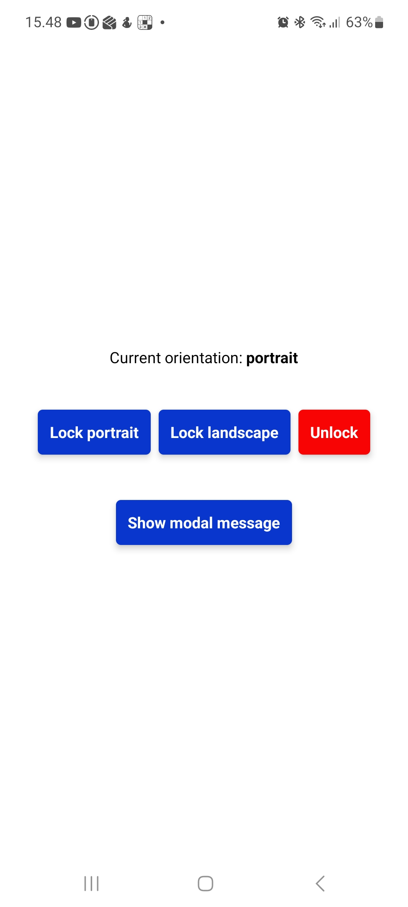
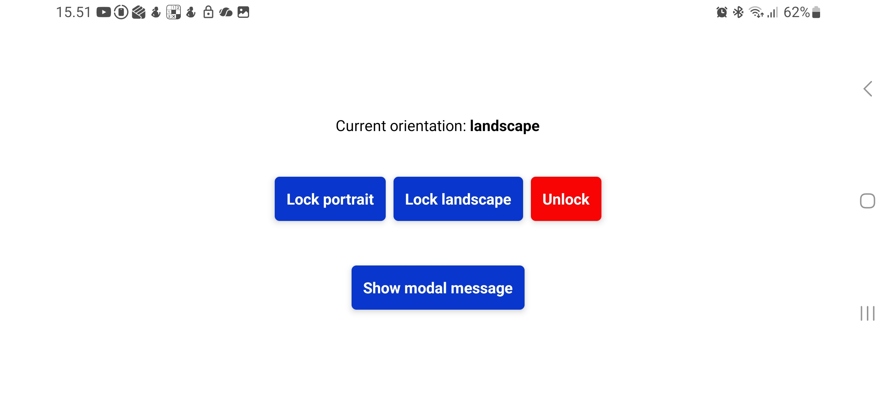

# 🎯 React Native Modal + Screen Orientation Harjoitus

Pieni **React Native + Expo** -harjoitus, jossa opetellaan kahta asiaa:

1. **Modal-komponentin käyttö ja tyylittely**
2. **Laitteen ruudun orientationin (portrait / landscape) tunnistus ja lukitseminen**

---

## 💡 Pääideat

### 🟣 Modal
- Avataan ja suljetaan `useState`-tilan avulla  
- Testataan `animationType` ja `transparent` -asetuksia  
- Harjoitellaan varjoja (`shadowOffset`, `shadowOpacity`, `elevation`)  
- Modal skaalautuu myös landscape-tilassa

### 🔵 Screen Orientation
- `expo-screen-orientation` kirjaston käyttö  
- `getOrientationAsync()` → hakee alkutilan  
- `addOrientationChangeListener()` → kuuntelee suunnan muutoksia  
- Napit:
  - **Lock portrait**
  - **Lock landscape**
  - **Unlock orientation**

---

## 🧩 Esimerkkikoodi (modal + orientation-tilan näyttö)

```jsx
<Modal
  animationType="fade"
  transparent={true}
  visible={modalVisible}
  onRequestClose={() => setModalVisible(false)}
>
  <View style={styles.centeredView}>
    <View style={styles.modalView}>
      <Text>This is modal... ({orientation})</Text>
      <Pressable onPress={() => setModalVisible(false)}>
        <Text>Close</Text>
      </Pressable>
    </View>
  </View>
</Modal>
```

## 📸 Kuvakaappaukset

<p align="left">




</p>