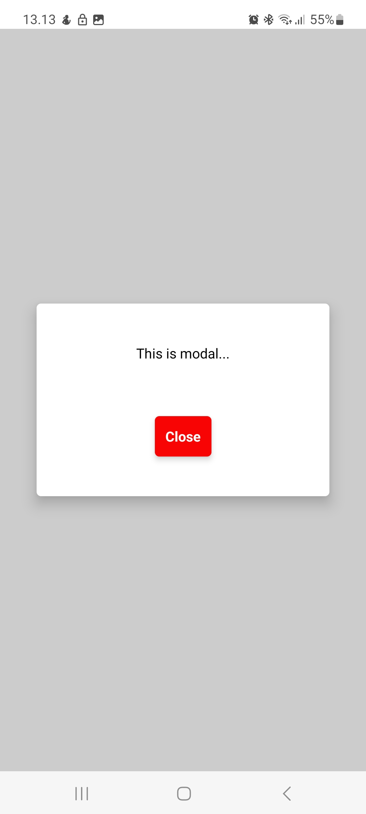

# 🎯 React Native Modal Harjoitus

Pieni **React Native + Expo** -harjoitus, jossa opetellaan käyttämään ja tyylittelemään
`Modal`-komponenttia.  
Tarkoituksena on oppia avaamaan, sulkemaan ja muokkaamaan modaalin ulkoasua eri tavoilla.

---

## 💡 Pääideat

- Modal avataan ja suljetaan `useState`-tilan avulla  
- Käytetään `animationType="slide"` ja `transparent={true}` asetuksia  
- Harjoitellaan varjojen (`shadowOffset`, `elevation`) käyttöä iOS:ssä ja Androidissa  
- Muokataan modalin kokoa, muotoa ja taustaa

---

## 🧩 Esimerkkikoodi

```jsx
<Modal
  animationType="slide"
  transparent={true}
  visible={modalVisible}>
  <View style={styles.modalView}>
    <Text>This is modal...</Text>
    <Pressable onPress={() => setModalvisible(false)}>
      <Text>Close</Text>
    </Pressable>
  </View>
</Modal>
````
---

## 📸 Kuvakaappaukset

<p align="left">


</p>